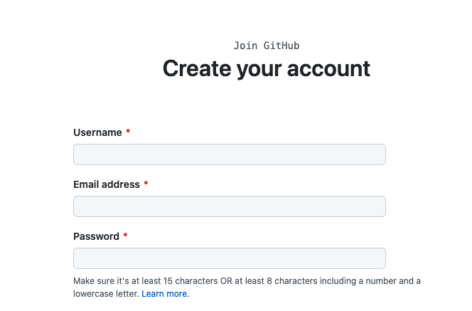

# Sentiment Analysis
Analyze sentiment of a specific brand using twitter data. 
## Contents

- [Project Objective](#project-objective)
- [Prerequisites](#prerequisites)
- [Git commands](#git-commands)
- [Project steps](#project-steps)


## Project Objective

The basic goal is to find sentiment of a text data. The given text is from tweets obtained from Twitter from  a specific brand(Nike, addidas, starbucks etc). The task is to identify if the tweets have a Negative, Positive, or Neutral sentiment towards the brand.

- Sentiment Analysis : Sentiment Analyis is the process of collecting and analyzing data based upon personal feelings, reviews and thoughts.
It is done by using various machine learning techniques, statistical models and Natural Language Processing(NLP) for extraction of a feature from a large data. 

- NLTK : Natural Language Toolkit(NLTK) is a library in python, containing resources for python that can be used for text processing, tagging, tokenizing. It transforms text in tweets into a format that can be used to extract sentiment.

- WordCloud - Word Cloud is a popular visualisation tool that is used to visualise textual data. The words are sized according their frequency of occurrence in a bag of words and arranged in random order. Word Cloud gives a quick and dirty insight about what’s inside a bag of texts.


## Prerequisites

#### Install python, pycharm, git

- https://www.python.org/downloads/
- https://www.jetbrains.com/pycharm/download/
- For windows : https://git-scm.com/download/win

 Note: Step by step tutorial for windows to get till `git cli` https://phoenixnap.com/kb/how-to-install-git-windows
- For Mac : https://git-scm.com/download/mac

Note- If brew is not in mac, must install brew first https://treehouse.github.io/installation-guides/mac/homebrew

#### Sign up to create Github account

https://github.com/join


## Git commands 
### Get access to github 
#### Run these commands to get access
- git config --global user.name "github_username"
- git config --global user.email "email_address"

For Mac: run in terminal, For Windows: run in git bash

#### Run the command to clone the project
- git clone git@github.com:sthirani/sentiment-analysis.git

## Project steps

- import dependencies

```
import tweepy
import csv
import pandas as pd
import re
import numpy as np
import nltk
...
```

- grabbing tweets using Twitter API

  - Authentication

  ```
  auth = tw.OAuthHandler(consumer_key, consumer_secret)
  auth.set_access_token(access_token, access_token_secret)
  api = tw.API(auth, wait_on_rate_limit=True)
  ```

  - collect tweet on a topic

  ```
  tweets = tw.Cursor(api.search,q=search_words,...)
  ```

  - write to a csv file

  ```
  csvWriter = csv.writer(csvFile)
  ```

- load the dataset

````
dataset = load_dataset("trump_tweets.csv", ['target','text']) ```
````

- pre-process data by removing `#`, `@`,`/,.$"\` etc

````
    tweet = re.sub(r'\@\w+|\#','', tweet)
    # Remove punctuations
    tweet = tweet.translate(str.maketrans('', '', string.punctuation))
    # Remove stopwords
    tweet_tokens = word_tokenize(tweet) 
````
- visualize the twitter data using `Wordcloud`
```
 wordcloud = WordCloud(width = 800, height = 800,
                          background_color ='white',
                          stopwords = stopwords,
                          min_font_size = 10).generate(words)

```
- analyze data to determine sentiment using `VADER`

````
from nltk.sentiment.vader import SentimentIntensityAnalyzer
analyzer = SentimentIntensityAnalyzer()
````

- Example results on wordcloud and the overall sentiment is attached
- Tips & Tricks
    - Can save data in file
    ````
  np.savetxt("ans.csv", y_test, delimiter=',', fmt='%s') 
    ````
    - run DisableSSL.py to download nltk modules if necessary